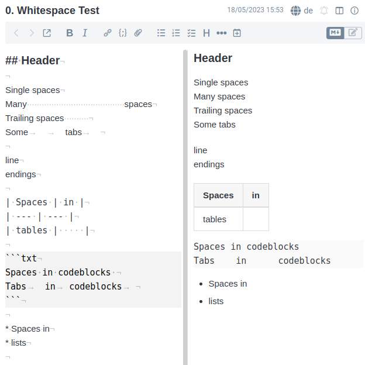

# joplin-plugin-whitespacer

:heavy_exclamation_mark: **Please use [Extra Markdown editor settings](https://joplinapp.org/plugins/plugin/io.github.personalizedrefrigerator.codemirror6-settings/) instead** :heavy_exclamation_mark:

Simply show whitespaces in Joplin's markdown editor.

